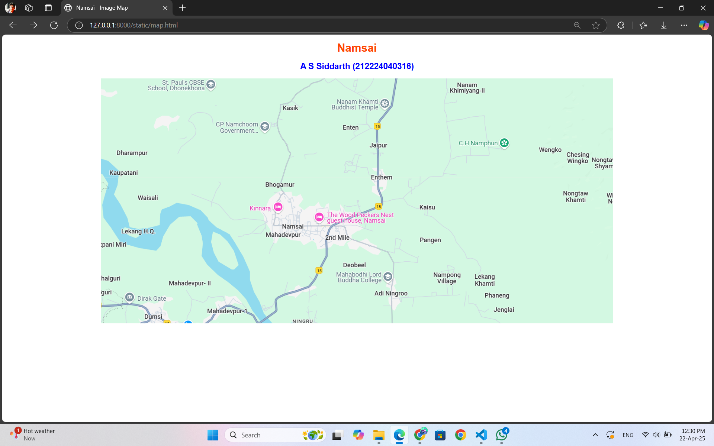
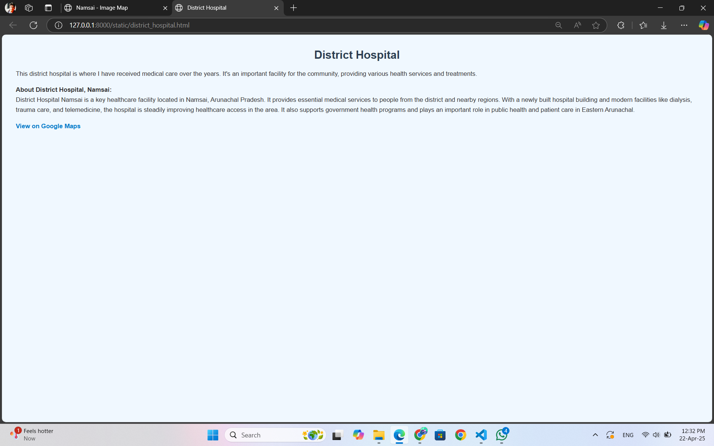

# Ex04 Places Around Me
# Date: 20/04/25
# AIM
To develop a website to display details about the places around my house.

# DESIGN STEPS
## STEP 1
Create a Django admin interface.

## STEP 2
Download your city map from Google.

## STEP 3
Using <map> tag name the map.

## STEP 4
Create clickable regions in the image using <area> tag.

## STEP 5
Write HTML programs for all the regions identified.

## STEP 6
Execute the programs and publish them.

# CODE
```
map.html

<!DOCTYPE html>
<html lang="en">
<head>
    <meta charset="UTF-8">
    <title>Namsai - Image Map</title>
    <style>
        body {
            font-family: Arial, sans-serif;
            background-color: #fff;
            text-align: center;
            margin: 0;
            padding: 0;
        }
        h1 {
            color: orangered;
            margin-top: 20px;
        }
        h2 {
            color: blue;
            margin-bottom: 20px;
        }
        img {
            display: block;
            margin: 0 auto;
            max-width: 100%;
        }
    </style>
</head>
<body>
    <h1>Namsai</h1>
    <h2> A S Siddarth (212224040316)</h2>

    

    <map name="image-map">
        <area target="_blank" alt="My Home" title="My Home" href="my_home.html" coords="471,148,50" shape="circle">
        <area target="_blank" alt="My Home Town" title="My Home Town" href="my_home_town.html" coords="553,427,45" shape="circle">
        <area target="_blank" alt="My Elementary School" title="My Elementary School" href="my_elementary_school.html" coords="527,342,38" shape="circle">
        <area target="_blank" alt="Buddhist Temple" title="Buddhist Temple" href="buddhist_temple.html" coords="586,407,40" shape="circle">
        <area target="_blank" alt="District Hospital" title="District Hospital" href="district_hospital.html" coords="611,437,42" shape="circle">
    </map>
</body>
</html>


district_hospital.html

<!DOCTYPE html>
<html lang="en">
<head>
    <meta charset="UTF-8">
    <meta name="viewport" content="width=device-width, initial-scale=1.0">
    <title>District Hospital</title>
    <style>
        body {
            background-color: #f0f8ff;
            font-family: Arial, sans-serif;
            margin: 40px;
            color: #333;
        }
        h1 {
            color: #2c3e50;
            text-align: center;
        }
        p {
            font-size: 18px;
            line-height: 1.6;
        }
        a {
            color: #007acc;
            text-decoration: none;
            font-weight: bold;
        }
        a:hover {
            color: #005b99;
            text-decoration: underline;
        }
    </style>
</head>
<body>
    <h1>District Hospital</h1>

    <p>This district hospital is where I have received medical care over the years. It's an important facility for the community, providing various health services and treatments.</p>

    <p><strong>About District Hospital, Namsai:</strong><br>
    District Hospital Namsai is a key healthcare facility located in Namsai, Arunachal Pradesh. It provides essential medical services to people from the district and nearby regions. With a newly built hospital building and modern facilities like dialysis, trauma care, and telemedicine, the hospital is steadily improving healthcare access in the area. It also supports government health programs and plays an important role in public health and patient care in Eastern Arunachal.</p>

    <p><a href="https://maps.app.goo.gl/fdpf1UPAQNiysA7u7" target="_blank">View on Google Maps</a></p>
</body>
</html>

buddhist_temple.html

<!DOCTYPE html>
<html lang="en">
<head>
    <meta charset="UTF-8">
    <meta name="viewport" content="width=device-width, initial-scale=1.0">
    <title>Buddhist Temple</title>
    <style>
        body {
            font-family: Arial, sans-serif;
            background-color: #f4f4f4;
            color: #333;
            margin: 0;
            padding: 0;
        }
        h1 {
            text-align: center;
            color: #8a2be2;
            background-color: #fff;
            padding: 20px;
            margin-bottom: 0;
            border-bottom: 2px solid #8a2be2;
        }
        p {
            font-size: 18px;
            line-height: 1.6;
            color: #444;
            padding: 15px 20px;
            text-align: center;
        }
        a {
            color: #fff;
            background-color: #8a2be2;
            padding: 10px 15px;
            text-decoration: none;
            border-radius: 5px;
            font-weight: bold;
        }
        a:hover {
            background-color: #6a1d9d;
        }
    </style>
</head>
<body>
    <h1>Buddhist Temple</h1>
    <p>This Buddhist temple holds a lot of spiritual significance for me. I often visit here to reflect, meditate, and find peace. The temple's serene environment is perfect for contemplation.</p>
    <p>Located in the heart of Namsai town, this monastery was one of the first prominent structures to come up in the area. Situated within the Pariyati Sasana Buddha Vihara, Namsai, it is surrounded by beautiful temples in a vast compound along with other delightful structures.</p>
    <p><a href="https://maps.app.goo.gl/pK8xubJs4NKPWrK78" target="_blank">View on Google Maps</a></p>
</body>
</html>

my_elementary_school.html

<!DOCTYPE html>
<html lang="en">
<head>
    <meta charset="UTF-8">
    <meta name="viewport" content="width=device-width, initial-scale=1.0">
    <title>My Elementary School</title>
    <style>
        body {
            font-family: Arial, sans-serif;
            background-color: #f0f8ff;
            color: #333;
            margin: 0;
            padding: 0;
        }
        h1 {
            text-align: center;
            color: #ff6347;
            background-color: #fff;
            padding: 20px;
            margin-bottom: 0;
            border-bottom: 2px solid #ff6347;
        }
        p {
            font-size: 18px;
            line-height: 1.6;
            color: #444;
            padding: 15px 20px;
            text-align: center;
        }
        a {
            color: #fff;
            background-color: #ff6347;
            padding: 10px 15px;
            text-decoration: none;
            border-radius: 5px;
            font-weight: bold;
        }
        a:hover {
            background-color: #e53e3e;
        }
    </style>
</head>
<body>
    <h1>My Elementary School</h1>
    <p>This is the elementary school where I spent my early years. I have many memories of my childhood here, from school events to childhood friends.</p>
    <p>Zenith Child School aims to provide quality education that nurtures the intellectual and personal growth of students. The institution emphasizes holistic development, fostering skills such as critical thinking, creativity, and social responsibility. By adhering to the 5+3+3+4 pattern of the National Education Policy, the school ensures a structured and comprehensive learning experience.</p>
    <p><a href="https://maps.app.goo.gl/wMSYvumxRGZuvsBRA" target="_blank">View on Google Maps</a></p>
</body>
</html>

my_home_town.html

<!DOCTYPE html>
<html lang="en">
<head>
    <meta charset="UTF-8">
    <meta name="viewport" content="width=device-width, initial-scale=1.0">
    <title>My Home Town</title>
    <style>
        body {
            font-family: Arial, sans-serif;
            background-color: #e0f7fa;
            color: #333;
            margin: 0;
            padding: 0;
        }
        h1 {
            text-align: center;
            color: #00796b;
            background-color: #fff;
            padding: 20px;
            margin-bottom: 0;
            border-bottom: 2px solid #00796b;
        }
        p {
            font-size: 18px;
            line-height: 1.6;
            color: #444;
            padding: 15px 20px;
            text-align: center;
        }
        a {
            color: #fff;
            background-color: #00796b;
            padding: 10px 15px;
            text-decoration: none;
            border-radius: 5px;
            font-weight: bold;
        }
        a:hover {
            background-color: #004d40;
        }
    </style>
</head>
<body>
    <h1>My Home Town</h1>
    <p>This is the town where I was born. It holds a special place in my heart as my roots are here. The town is known for its rich cultural heritage and historic sites.</p>
    <p>Namsai is a picturesque town and administrative headquarters of Namsai district in Arunachal Pradesh, located in the northeastern part of India. It is known for its vibrant cultural heritage, scenic landscapes, and a blend of different ethnic groups. Situated near the Myanmar border, Namsai is a gateway to the rich cultural diversity of the region, particularly the Tai-Khamti and Singpho tribes.</p>
    <p>The town is known for its lush green forests, tea gardens, and beautiful monasteries, such as the Golden Pagoda, which attracts visitors and pilgrims alike. Namsai also has a growing educational and commercial presence, with infrastructure developments supporting the local economy.</p>
    <p>With its serene environment, historical significance, and cultural diversity, Namsai is becoming a notable destination for both tourism and development in the state.</p>
    <p><a href="https://maps.app.goo.gl/kcXngzmBxa9W3c2D7" target="_blank">View on Google Maps</a></p>
</body>
</html>

my_home.html

<!DOCTYPE html>
<html lang="en">
<head>
    <meta charset="UTF-8">
    <meta name="viewport" content="width=device-width, initial-scale=1.0">
    <title>My Home</title>
    <style>
        body {
            font-family: Arial, sans-serif;
            background-color: #fff8e1;
            color: #333;
            margin: 0;
            padding: 0;
        }
        h1 {
            text-align: center;
            color: #ff9800;
            background-color: #fff;
            padding: 20px;
            margin-bottom: 0;
            border-bottom: 2px solid #ff9800;
        }
        p {
            font-size: 18px;
            line-height: 1.6;
            color: #444;
            padding: 15px 20px;
            text-align: center;
        }
        a {
            color: #fff;
            background-color: #ff9800;
            padding: 10px 15px;
            text-decoration: none;
            border-radius: 5px;
            font-weight: bold;
        }
        a:hover {
            background-color: #f57c00;
        }
    </style>
</head>
<body>
    <h1>My Home</h1>
    <p>This is the place where I have lived for more than 10 years. It's a quiet neighborhood with friendly neighbors, and it's where I grew up and spent most of my life.</p>
    <p>The college is equipped with modern facilities to support the academic and extracurricular development of its students. These include well-equipped laboratories, a library, hostels, and a Wi-Fi-enabled campus. The infrastructure is designed to provide a conducive learning environment for all students.</p>
    <p><a href="https://maps.app.goo.gl/MhzayRhoaE64UccM9" target="_blank">View on Google Maps</a></p>
</body>
</html>


```
# OUTPUT
map.html


my_home.html


my_elementary_school.html


buddhist_temple.html


district_hospital.html


my_home_town.html


# RESULT
The program for implementing image maps using HTML is executed successfully.
